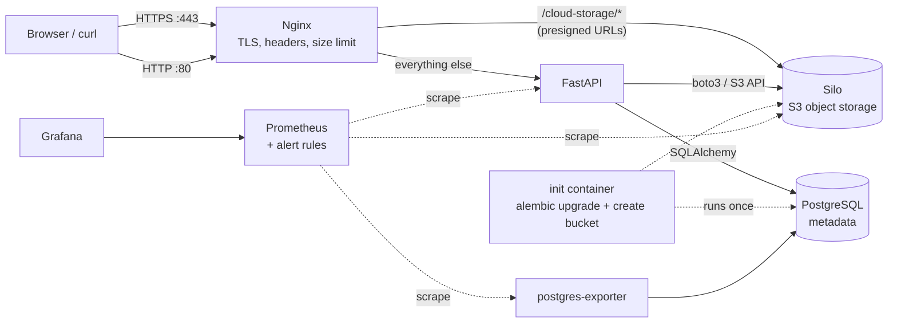
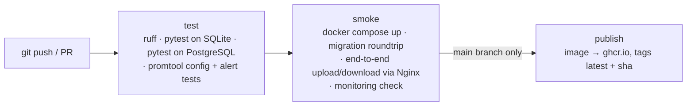

# Personal Cloud Storage

[](https://github.com/aabdridho/personal-cloud-storage/actions/workflows/ci.yml)

A self-hosted, Google Drive–style file storage service for one family, built step by step as a cloud-engineering learning project. Every family member has a private drive with a quota, and the family shares common folders. Files live in S3-compatible object storage, metadata in PostgreSQL, and the whole stack runs behind an Nginx reverse proxy with HTTPS, with one `docker compose up`.

> **Status:** Phase 9 of 12 complete. Built and tested locally (Windows + WSL 2); deployment to a home server is planned for Phase 12. See the [roadmap](docs/roadmap.md).

## Highlights

- **REST API (FastAPI)**: upload, list, search, paginate, rename, move, download and delete files; private and shared folders.
- **Object storage over the S3 API**: file bytes go to [Silo](https://github.com/pgsty/silo), a community fork of MinIO, through `boto3`. Swapping to AWS S3, Cloudflare R2 or Garage needs configuration changes only.
- **Downloads bypass the API**: the API answers with a `307` redirect to a short-lived presigned URL, so file bytes stream straight from storage with range requests (resume, video seeking) intact.
- **Authentication and authorization**: Argon2id password hashing, JWT access tokens, admin-managed accounts (no public sign-up), per-user isolation, and a deliberate `404` vs `403` policy so the API never confirms that someone else's private file exists.
- **Quotas and limits**: per-user storage quota (`507`), per-file size limit enforced at the edge by Nginx and again in the API (`413`).
- **Database migrations**: Alembic, with every migration reversible and verified in CI (`downgrade base → upgrade head → alembic check`).
- **Containerized**: Docker Compose with health checks, an init container that runs migrations and creates the bucket before the API starts, a non-root API user, and no database port exposed to the host.
- **Edge security**: Nginx terminates TLS, redirects HTTP to HTTPS, hides version banners, adds security headers, strips the JWT before proxying to storage, and is the only entry point.
- **CI/CD (GitHub Actions)**: lint, unit tests against SQLite *and* PostgreSQL, alert-rule unit tests, a full-stack smoke test of the real Docker stack, then image publishing to GHCR tagged by commit SHA.
- **Monitoring**: Prometheus scrapes the API (HTTP rate, latency, errors plus app metrics such as uploads, logins and per-user quota), PostgreSQL and Silo; a provisioned Grafana dashboard and eight alert rules, all checked by `promtool` tests and in CI.

## Architecture



PostgreSQL stores *who owns what* (users, folders, file names, sizes, content types, ETags). Silo stores only the bytes, under random UUID keys, so renaming or moving a file is a single database update. More detail in [docs/architecture.md](docs/architecture.md).

## Tech stack

| Layer | Choice |
|---|---|
| API | Python 3.12, FastAPI, Pydantic v2, Uvicorn |
| Data | PostgreSQL 18, SQLAlchemy 2, Alembic |
| Object storage | Silo (MinIO-compatible), boto3 |
| Auth | PyJWT (HS256), pwdlib + Argon2id |
| Edge | Nginx (TLS 1.2/1.3, HTTP/2) |
| Containers | Docker, Docker Compose |
| Quality | pytest, moto (S3 mock), ruff, actionlint, shellcheck, promtool |
| Monitoring | Prometheus, Grafana, postgres-exporter, prometheus-fastapi-instrumentator |
| CI/CD | GitHub Actions, GitHub Container Registry |

## Quick start (Docker)

Requirements: Docker Engine with Compose v2 (Docker Desktop, or Docker Engine inside WSL 2), and OpenSSL.

```bash
git clone https://github.com/aabdridho/personal-cloud-storage.git
cd personal-cloud-storage

# 1. Secrets: copy the template and replace every "ganti-saya" value
cp .env.example .env

# 2. Self-signed certificate for https://localhost
mkdir -p nginx/certs
openssl req -x509 -newkey rsa:2048 -nodes -days 365 \
  -keyout nginx/certs/localhost.key -out nginx/certs/localhost.crt \
  -subj "/CN=localhost" -addext "subjectAltName=DNS:localhost,IP:127.0.0.1"

# 3. Start everything (migrations and bucket creation run automatically)
docker compose up -d --build

# 4. Create the first admin account (prompts for a password)
docker compose exec api python create_user.py <username> --admin
```

Then open **https://localhost/docs** (accept the self-signed certificate warning), click **Authorize**, and log in. Admin-only consoles listen on the loopback interface only: Grafana at http://127.0.0.1:3000 (user `admin`, password `GRAFANA_ADMIN_PASSWORD`), Prometheus at http://127.0.0.1:9090, Silo at http://127.0.0.1:9001.

Full operating guide, including local development without Docker: [docs/operations.md](docs/operations.md).

## API at a glance

| Method | Path | Who | Purpose |
|---|---|---|---|
| `POST` | `/auth/login` | anyone | Exchange username + password for a JWT |
| `GET` | `/auth/me`, `/auth/me/storage` | user | Profile, storage used vs quota |
| `GET` `POST` `PATCH` | `/users`, `/users/{id}` | admin | List, create, deactivate, set quota |
| `GET` `POST` `PATCH` `DELETE` | `/folders`, `/folders/{id}` | user | Private and shared folders |
| `POST` `GET` | `/files` | user | Upload (multipart), list with search, filter and pagination |
| `PATCH` `DELETE` | `/files/{id}` | uploader | Rename, move, delete |
| `GET` | `/files/{id}` | owner / shared folder | `307` redirect to a presigned download URL |
| `GET` | `/files/{id}/link?expires=` | owner / shared folder | Share link valid 60 s – 7 days |
| `GET` | `/health` | anyone | Health check |

Status codes, access rules and examples: [docs/api.md](docs/api.md).

## Testing and CI

```bash
pip install -r requirements-dev.txt
ruff check .
pytest -v                                   # SQLite + mocked S3, ~6 s
TEST_DATABASE_URL=postgresql+psycopg://... pytest -v   # same tests on PostgreSQL
bash scripts/smoke_test.sh                  # end-to-end, against a running stack
bash scripts/monitoring_check.sh            # targets up, alerts loaded, dashboard provisioned
```



Details: [docs/testing-and-ci.md](docs/testing-and-ci.md).

## Security

Passwords are hashed with Argon2id; login resists username enumeration (identical errors and timing); tokens expire after 60 minutes and are re-checked against the account's active flag on every request; other users' private resources answer `404`; presigned URLs are short-lived and protected from leaking through `Referer`; the database is never exposed outside the Docker network; the API runs as a non-root user; secrets live only in `.env` and never enter the image or the repository.

The threat model, every control, and the known gaps scheduled for Phase 11 are in [docs/security.md](docs/security.md).

## Documentation

| Document | Contents |
|---|---|
| [docs/architecture.md](docs/architecture.md) | Components, data model, request flows |
| [docs/api.md](docs/api.md) | Endpoints, access rules, status codes |
| [docs/operations.md](docs/operations.md) | Running, administering and troubleshooting the stack |
| [docs/monitoring.md](docs/monitoring.md) | Metrics, dashboard, alert rules, useful queries |
| [docs/security.md](docs/security.md) | Threat model, controls, known gaps |
| [docs/testing-and-ci.md](docs/testing-and-ci.md) | Test strategy and pipeline |
| [docs/decisions.md](docs/decisions.md) | Architecture decision records |
| [docs/challenges.md](docs/challenges.md) | Real problems hit while building it, and how they were diagnosed |
| [docs/roadmap.md](docs/roadmap.md) | Phases 1–12 and what each one added |
| [docs/catatan-belajar.md](docs/catatan-belajar.md) | Learning notes and interview prep (Bahasa Indonesia) |

## Author

Abdurrasyid Ridho, Computer Engineering, Telkom University. [GitHub @aabdridho](https://github.com/aabdridho)
