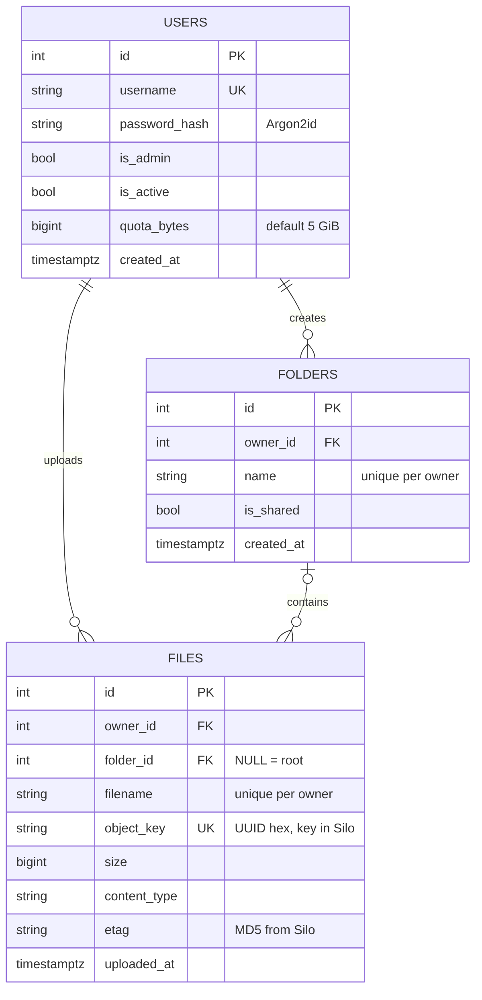
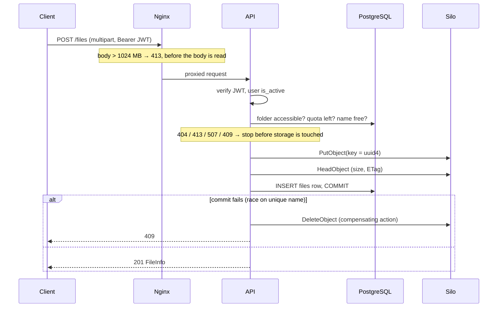
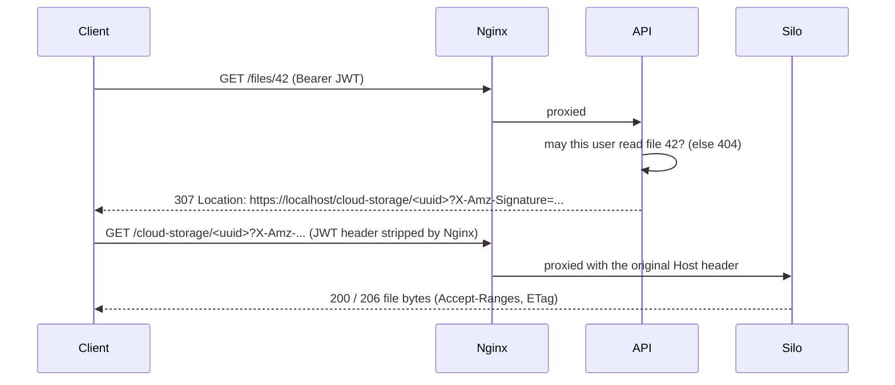

# Architecture

## Components

| Service | Image | Role | Reachable from the host |
|---|---|---|---|
| `nginx` | `nginx:stable-alpine` | Single entry point: TLS termination, HTTP→HTTPS redirect, security headers, request size limit, routing | `127.0.0.1:80`, `127.0.0.1:443` |
| `api` | built from `Dockerfile` | FastAPI application, runs as non-root `appuser` | No (only through Nginx) |
| `db` | `postgres:18` | Metadata: users, folders, files | No (Docker network only) |
| `silo` | `pgsty/silo:RELEASE.2026-09-16T00-00-00Z` | S3-compatible object storage for file bytes | Console only, `127.0.0.1:9001` |
| `init` | built from `Dockerfile` | One-shot: `alembic upgrade head` and create the bucket, then exit | — |
| `prometheus` | `prom/prometheus:v3.13.4` | Scrapes metrics every 15 s, evaluates alert rules, keeps 30 days | `127.0.0.1:9090` |
| `postgres-exporter` | `prometheuscommunity/postgres-exporter:v0.20.1` | Translates PostgreSQL statistics into Prometheus metrics | No |
| `grafana` | `grafana/grafana:13.2.3` | Dashboard, provisioned from files in the repository | `127.0.0.1:3000` |

All services share the Compose network `personal-cloud-storage_default`, where Docker's DNS resolves service names (`db`, `silo`, `api`). Data lives in named volumes (`pgdata`, `silodata`, plus `promdata` and `grafanadata` for monitoring), so containers can be destroyed and recreated without losing anything.

Start-up order is enforced with health checks: `db` and `silo` must be healthy → `init` must exit with code 0 → `api` starts and must be healthy → `nginx` starts. If a migration fails, the API never starts on a wrong schema.

## Code layout

```
main.py            assembles the app from routers, exposes /metrics
metrics.py         Prometheus counters and the database-backed storage collector
config.py          reads configuration and secrets from the environment
database.py        engine, session factory, get_db dependency
models.py          SQLAlchemy tables: User, Folder, FileRecord
schemas.py         Pydantic request/response models
security.py        Argon2 hashing, JWT create/verify
auth.py            get_current_user / get_current_admin dependencies
permissions.py     every access rule for files and folders, in one place
services.py        shared queries (storage usage)
storage.py         boto3 clients and presigned URL generation
routers/           login.py · users.py · folders.py · files.py
migrations/        Alembic environment and versioned migrations
create_user.py     CLI: create an account
reset_password.py  CLI: reset a password
init_storage.py    idempotent bucket creation (used by the init container)
nginx/default.conf reverse proxy configuration
monitoring/        Prometheus config + alert rules (+ tests), Grafana provisioning and dashboard
tests/             pytest suite (SQLite or PostgreSQL + moto S3)
scripts/           end-to-end smoke test, monitoring check
```

## Data model



Design points:

- **The database is the source of truth.** An object in Silo that has no row in `files` does not exist as far as the application is concerned.
- **Object keys are random UUIDs, not file names.** File names can contain anything, two users can both have `foto.jpg`, keys cannot be guessed, and renaming or moving a file never touches storage.
- **`size` is `BIGINT`**, so files above 2 GiB fit.
- **Timestamps are `timestamptz`** and the API always serializes them in UTC (`...Z`).
- **Foreign keys** prevent orphaned metadata: a user with files, or a folder with files, cannot be deleted at the database level.

Migrations, in order: `dffaeac8f5e0` create files table → `1b00f45a2698` users and file ownership → `66100af107ea` user storage quota (uses `server_default` so existing rows are filled) → `ee646de316e8` folders (nullable `folder_id`, so no default is needed).

## Request flows

### Upload



The bytes go to storage first and the row second. If the commit fails, the API deletes the object it just wrote. The worst leftover is an orphaned object that no user can see, never a row pointing at missing data. Deletion uses the opposite order (row first, then object) for the same reason.

### Download



Generating a presigned URL is pure cryptography: the API signs bucket, key, expiry and the `Host` header with the storage secret, without contacting Silo. Because `Host` is part of the signature, the API keeps two S3 clients: `s3` talks to `http://silo:9000` inside the Docker network, and `s3_public` signs URLs for the address the browser actually uses (`S3_PUBLIC_ENDPOINT`, e.g. `https://localhost`).

Nginx routes `/cloud-storage/*` to Silo and everything else to the API, so presigned URLs share the API's origin. That removes CORS problems in the browser, but it also means a browser or `curl -L` keeps the `Authorization` header across the redirect. Silo rejects requests that carry two authentication methods, so Nginx clears that header (`proxy_set_header Authorization ""`) on the storage route.

## Configuration

All configuration comes from environment variables (`.env` locally, the `x-app-env` block in `compose.yaml` for containers). See [`.env.example`](../.env.example).

| Variable | Purpose | Default |
|---|---|---|
| `DATABASE_URL` | SQLAlchemy URL | SQLite file `app.db` |
| `S3_ENDPOINT` | Storage address used by the API | required |
| `S3_PUBLIC_ENDPOINT` | Address put into presigned URLs | `S3_ENDPOINT` |
| `S3_ACCESS_KEY`, `S3_SECRET_KEY` | Storage credentials | required |
| `S3_BUCKET` | Bucket name | required |
| `JWT_SECRET` | HMAC key for tokens | required |
| `ACCESS_TOKEN_EXPIRE_MINUTES` | Token lifetime | `60` |
| `MAX_UPLOAD_MB` | Per-file limit in the API | `1024` |
| `DEFAULT_QUOTA_GB` | Quota for new users | `5` |

Required variables are read with `os.environ[...]`, so a missing secret stops the application at start-up instead of failing later on a request.
