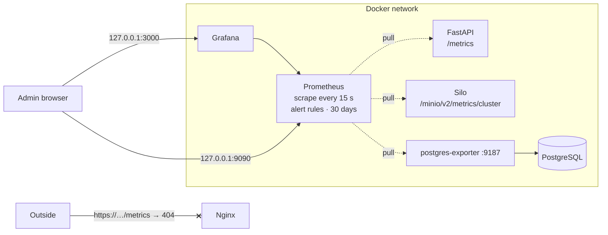

# Monitoring

Prometheus collects metrics from every part of the stack, Grafana shows them on one dashboard, and alert rules flag problems before the family notices them.



| Component | Where | Notes |
|---|---|---|
| Prometheus | http://127.0.0.1:9090 | `/targets` scrape status, `/alerts` alert state, `/graph` ad-hoc queries |
| Grafana | http://127.0.0.1:3000 | Login `admin` / `GRAFANA_ADMIN_PASSWORD`; dashboard *Personal Cloud Storage* |
| Configuration | `monitoring/prometheus/` | `prometheus.yml`, `alerts.yml`, `alerts.test.yml` |
| Dashboard | `monitoring/grafana/` | Provisioned data source (uid `prometheus`) and dashboard JSON (uid `pcs-overview`) |

## Metrics

### HTTP (prometheus-fastapi-instrumentator)

| Metric | Labels | Meaning |
|---|---|---|
| `http_requests_total` | `handler`, `method`, `status` (`2xx`, `4xx`, …) | Requests, by route template such as `/files/{file_id}` |
| `http_request_duration_seconds` | `handler`, `method` | Latency histogram |
| `http_request_size_bytes`, `http_response_size_bytes` | `handler` | Body sizes |

`/health` and `/metrics` are excluded so health checks and scrapes do not drown real traffic.

### Application (`metrics.py`)

| Metric | Type | Labels | Meaning |
|---|---|---|---|
| `pcs_file_uploads_total` | counter | `result`: `success`, `too_large`, `quota_exceeded`, `conflict` | Upload attempts |
| `pcs_file_upload_bytes_total` | counter | | Bytes stored by successful uploads |
| `pcs_file_downloads_total` | counter | `kind`: `redirect`, `share_link` | Presigned URLs issued |
| `pcs_file_deletes_total` | counter | | Files deleted |
| `pcs_login_attempts_total` | counter | `result`: `success`, `failure` | Logins |
| `pcs_files` | gauge | | Files stored |
| `pcs_stored_bytes` | gauge | | Sum of file sizes |
| `pcs_users` | gauge | `status`: `active`, `inactive` | Accounts |
| `pcs_folders` | gauge | `type`: `shared`, `private` | Folders |
| `pcs_user_used_bytes`, `pcs_user_quota_bytes` | gauge | `username` | Usage and quota per active user |
| `pcs_metrics_db_up` | gauge | | 1 if the collector could query PostgreSQL |

Counters live in the API process and restart from zero when the container restarts; `rate()` and `increase()` handle that. Gauges are computed by a custom collector that queries PostgreSQL on every scrape, so they are always the true values (the database is the source of truth, see ADR-003 and ADR-014).

### PostgreSQL and Silo

postgres-exporter provides `pg_up`, `pg_stat_database_*` (connections, commits, rollbacks) and `pg_database_size_bytes`. Silo provides `minio_cluster_capacity_usable_{total,free}_bytes`, `minio_bucket_usage_total_bytes` and many more, enabled with `MINIO_PROMETHEUS_AUTH_TYPE=public`.

## Dashboard

| Row | Panels |
|---|---|
| Overview | API / PostgreSQL / Silo up, files, stored bytes, active users, disk free |
| API traffic | Requests per second by status class, p95 latency per endpoint, top endpoints in 24 h, logins by result |
| Storage | Uploads by result, downloads and deletes, upload throughput, quota used per user, bucket size vs database total |
| PostgreSQL | Connections, database size, transactions per second |

*Bucket size vs database total* compares Silo's own count with the sum in PostgreSQL. A gap that keeps growing means orphaned objects (see the known gaps in [security.md](security.md)).

## Alert rules

| Alert | Condition | For | Severity |
|---|---|---|---|
| `TargetDown` | Any scrape target unreachable | 2 m | critical |
| `PostgresDown` | `pg_up == 0` | 1 m | critical |
| `MetricsCollectorCannotReachDatabase` | `pcs_metrics_db_up == 0` | 2 m | warning |
| `HighServerErrorRate` | More than 5% of API requests are `5xx` | 5 m | warning |
| `SlowRequests` | p95 latency above 1 s, uploads excluded | 10 m | warning |
| `LoginFailureSpike` | More than 20 failed logins in 15 minutes | — | warning |
| `UserQuotaAlmostFull` | A user above 90% of quota | 5 m | info |
| `StorageDiskAlmostFull` | Less than 10% free on the storage disk | 10 m | critical |

`for:` keeps a short blip from raising an alert. The rules are unit-tested with synthetic data:

```bash
cd monitoring/prometheus
docker run --rm --entrypoint promtool -v "$PWD:/p" -w /p prom/prometheus:v3.13.4 test rules alerts.test.yml
```

Alerts currently appear in Prometheus (`/alerts`) and in Grafana. Delivering them to a phone (Alertmanager or a Grafana contact point) is listed in the roadmap.

## Useful queries

```promql
# Requests per second, by status class
sum by (status) (rate(http_requests_total{job="api"}[5m]))

# p95 latency of the download endpoint
histogram_quantile(0.95, sum by (le) (rate(http_request_duration_seconds_bucket{handler="/files/{file_id}", method="GET"}[5m])))

# Who is closest to their quota
sort_desc(pcs_user_used_bytes / pcs_user_quota_bytes)

# Uploads rejected in the last day, by reason
sum by (result) (increase(pcs_file_uploads_total{result!="success"}[1d]))

# Days until the storage disk is full, from the last 7 days' trend
minio_cluster_capacity_usable_free_bytes / -deriv(minio_cluster_capacity_usable_free_bytes[7d]) / 86400
```

## Changing things

- **Rules or scrape config:** edit `monitoring/prometheus/*.yml`, run the `promtool` command above, then `docker compose restart prometheus`.
- **Dashboard:** edit the JSON in `monitoring/grafana/dashboards/` (or build it in the UI, *Export → JSON*, and save it there), then `docker compose restart grafana`. UI edits are not saved because the dashboard is provisioned read-only.
- **New application metric:** add it to `metrics.py`, increment it in the router, and cover it in `tests/test_metrics.py`. Keep label values bounded (never file IDs or names).
